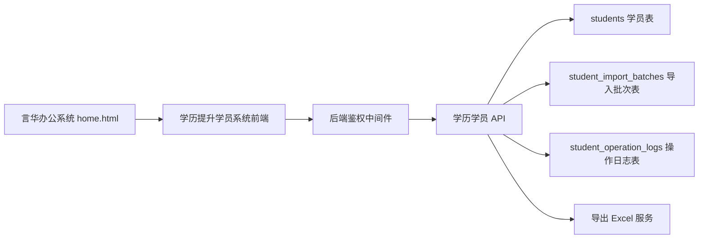

# 学历提升学员系统技术方案

## 1. 技术目标

在现有言华办公系统中新增真实数据库版“学历提升学员系统”，实现最高管理员专属的学员档案管理、Excel 导入导出、软删除回收站和操作审计。

当前前端项目为静态页面系统，接口地址通过 `config.js` 指向 `https://cip.hkjzyk.top`。本功能需要同时改造前端页面、后端接口和数据库结构。

## 2. 数据库类型建议

长期推荐使用 PostgreSQL 作为正式数据库；本次第一版先沿用当前线上后端已经使用的 SQLite + `better-sqlite3`。

原因：

- 学员数据属于长期业务数据，后续会持续按年份、批次增长。
- 需要导入导出、筛选、权限、审计日志、软删除，PostgreSQL 更适合结构化查询和后续扩展。
- 支持事务，导入 Excel 时可保证同一批次成功或回滚。
- 支持索引、唯一约束和 JSON 字段，便于处理历史 Excel 的不规范备注。

本次第一版落地选择：

- 已确认线上后端位于 `/opt/yanhua-office/current`。
- 已确认线上数据库为 SQLite，数据库路径为 `/opt/yanhua-office/shared/data/app.db`。
- 第一版在原 SQLite 数据库内新增 3 张业务表，不迁移现有用户、工具、岗位、待办等数据。
- 部署前必须先执行线上数据库备份，并备份被覆盖的后端/前端文件。
- 后续当学员量、并发写入、权限模型或统计报表复杂度提升后，再规划从 SQLite 迁移到 PostgreSQL。
- 不建议继续使用纯 JSON 文件保存学员数据，因为并发写入、导入回滚、权限审计和数据恢复风险较高。

落地原则：第一版采用“原库加表”；未备份前不得执行建表或导入。

## 3. 系统架构



## 4. 前端模块设计

新增目录：

```text
tools/education-students/
  index.html
  app.js
  styles.css
```

前端职责：

- 从登录态读取当前用户。
- 调用权限接口或用户信息判断是否有 `educationStudentManage` 权限。
- 无权限时显示无权限状态，不渲染业务数据。
- 渲染学员列表、筛选、分页、详情、表单、导入预览、回收站。
- 调用后端真实接口完成 CRUD、导入导出和恢复。

导航入口：

- 后端工具配置新增“学历提升学员系统”。
- 位置在“待办系统”下方。
- 可见规则由后端根据权限返回工具列表。
- 如果当前工具配置暂不支持按用户权限返回，可前端兜底过滤，但后端接口仍必须强校验。

## 5. 后端接口设计

统一前缀：

```text
/api/education-students
```

### 5.1 权限

第一版与现有言华后台保持一致，所有接口校验：

```text
role === "admin"
```

当前系统多处接口通过请求参数或请求头传递 `role`、`username`，学历系统第一版按现有模式接入，并在接口层统一拦截非 `admin` 请求。后续安全增强建议改为真实 session/token 鉴权，并增加独立权限位 `educationStudentManage`。

### 5.2 API 清单

| 方法 | 路径 | 用途 |
| --- | --- | --- |
| GET | `/api/education-students` | 学员列表，支持筛选分页 |
| GET | `/api/education-students/:id` | 学员详情 |
| POST | `/api/education-students` | 新增学员 |
| PUT | `/api/education-students/:id` | 编辑学员 |
| DELETE | `/api/education-students/:id` | 软删除学员 |
| GET | `/api/education-students/recycle-bin` | 回收站列表 |
| POST | `/api/education-students/:id/restore` | 恢复学员 |
| POST | `/api/education-students/import/preview` | Excel 导入预览 |
| POST | `/api/education-students/import/commit` | 确认导入 |
| GET | `/api/education-students/export.xlsx` | 导出当前筛选结果 |
| GET | `/api/education-students/stats` | 统计卡片 |
| GET | `/api/education-students/logs` | 操作日志 |

### 5.3 列表查询参数

```text
keyword
businessType
year
enrollmentBatch
level
targetEducation
pushInstitution
status
deleted
page
pageSize
sortBy
sortOrder
```

## 6. 数据库设计

### 6.1 education_students 表

| 字段 | 类型建议 | 说明 |
| --- | --- | --- |
| id | bigint / uuid | 主键 |
| name | varchar(50) | 姓名 |
| phone | varchar(30) | 联系方式 |
| business_type | varchar(20) | open_university / adult_exam |
| year | int | 招生年份 |
| enrollment_batch | varchar(20) | 3月 / 9月 / 待确认 |
| original_education | varchar(30) | 原始学历 |
| target_education | varchar(30) | 目标学历 |
| level | varchar(30) | 高起专 / 专升本 / 高起本 |
| original_school | varchar(100) | 原学校 |
| original_major | varchar(100) | 原专业 |
| intended_major | varchar(100) | 意向专业 |
| apply_school | varchar(100) | 报考学校 |
| intention_method | varchar(50) | 学历意向方式，保留 Excel 字段 |
| deal_date | date | 成交日期 |
| registration_fee | numeric(10,2) | 报名费 |
| final_payment | numeric(10,2) | 尾款，成考适用 |
| push_institution | varchar(50) | 推送机构，国开适用 |
| status | varchar(30) | 状态 |
| remark | text | 备注 |
| source_file | varchar(200) | 来源文件名 |
| import_batch_id | bigint / uuid | 导入批次 |
| created_by | varchar(80) | 创建人 |
| updated_by | varchar(80) | 更新人 |
| deleted_by | varchar(80) | 删除人 |
| delete_reason | varchar(200) | 删除原因 |
| created_at | timestamp | 创建时间 |
| updated_at | timestamp | 更新时间 |
| deleted_at | timestamp nullable | 软删除时间 |

建议索引：

- `(business_type, year)`
- `(business_type, year, enrollment_batch)`
- `(push_institution)`
- `(deleted_at)`
- `(name, phone)`
- 全文/模糊搜索可先用普通 `LIKE`，数据量增长后再优化。

### 6.2 education_student_import_batches 表

| 字段 | 类型建议 | 说明 |
| --- | --- | --- |
| id | bigint / uuid | 主键 |
| file_name | varchar(200) | 文件名 |
| business_type | varchar(20) | 导入业务类型 |
| year | int | 年份 |
| total_rows | int | 预览总行数 |
| imported_rows | int | 成功导入行数 |
| skipped_rows | int | 跳过行数 |
| error_rows | int | 异常行数 |
| duplicate_strategy | varchar(30) | skip / update / merge |
| created_by | varchar(80) | 操作人 |
| created_at | timestamp | 操作时间 |

### 6.3 education_student_operation_logs 表

| 字段 | 类型建议 | 说明 |
| --- | --- | --- |
| id | bigint / uuid | 主键 |
| student_id | bigint / uuid nullable | 关联学员 |
| action | varchar(50) | create / update / delete / restore / import / export |
| operator | varchar(80) | 操作人 |
| detail | jsonb / text | 变更摘要 |
| created_at | timestamp | 操作时间 |

## 7. 导入规则

### 7.1 字段映射

国开和成考统一映射到 `students` 表：

| Excel 字段 | 数据库字段 |
| --- | --- |
| 姓名 | name |
| 联系方式 | phone |
| 原始学历 | original_education |
| 目标学历 | target_education |
| 原学校 | original_school |
| 原专业 | original_major |
| 意向专业 | intended_major |
| 报考学校 | apply_school |
| 学历意向方式 | intention_method |
| 成交日期 | deal_date |
| 报名费 | registration_fee |
| 尾款 | final_payment |
| 备注 | remark |

补充字段：

- `business_type` 由导入时选择或文件类型确定。
- `year` 由导入时选择或文件名识别。
- `level` 由原始学历和目标学历推断。
- `push_institution` 从备注识别或人工选择。
- `source_file` 保存源文件名。
- `import_batch_id` 保存导入批次。

### 7.2 重复识别

第一版建议重复判断键：

```text
姓名 + 联系方式 + 业务类型 + 年份 + 入学批次
```

成考如果无入学批次，可使用：

```text
姓名 + 联系方式 + 业务类型 + 年份
```

重复处理策略：

- 跳过：保留已有数据。
- 覆盖：用新导入字段覆盖旧数据。
- 合并备注：基础字段不覆盖，仅追加备注和导入来源。

### 7.3 校验规则

- 姓名为空：阻止导入。
- 联系方式为空：阻止导入。
- 手机号不足 11 位或包含异常字符：允许导入但标记“需复核”。
- 国开推送机构为空：新记录阻止保存；历史导入可进入“待确认”。
- 日期无法解析：允许空值导入并标记异常。
- 金额无法解析：允许空值导入并标记异常。

## 8. 删除与回收站

删除接口不执行物理删除，只更新：

```text
deleted_at
deleted_by
delete_reason
```

正常列表默认过滤 `deleted_at is null`。

回收站列表只展示 `deleted_at is not null`。

恢复操作清空删除字段，并写入操作日志。

## 9. 导出方案

导出类型：

- 当前筛选结果。
- 全部正常学员。
- 回收站数据。
- 按业务类型导出。

导出字段顺序应贴近原 Excel，但增加系统字段：

- 年份。
- 业务类型。
- 入学批次。
- 学历层次。
- 推送机构。
- 状态。
- 创建时间。
- 更新时间。

导出操作必须写日志，记录导出人、导出条件和导出条数。

## 10. 数据安全与部署方案

涉及线上数据库前必须执行：

1. 确认当前后端实际数据库类型和数据库路径/连接方式。
2. 备份线上数据库。
3. 备份上传目录、配置文件和运行时数据，如本次涉及。
4. 准备数据库迁移脚本。
5. 准备回滚脚本或回滚说明。
6. 先在测试环境或备份库验证迁移。
7. 用户确认后再执行线上迁移。

部署默认排除：

- 数据库文件。
- 上传文件。
- 日志文件。
- 缓存文件。
- 运行时生成文件。
- `.DS_Store`。

## 10.1 本次实现文件范围

后端完整项目目录：

```text
/Users/wangjinlong/Documents/Codex/99_归档/旧版本备份/言华教育工具系统-GenRenXiTong旧版
```

本次已实现或计划上线的后端文件：

```text
backend/db/index.js
backend/server.js
backend/routes/tools.js
backend/routes/educationStudents.js
frontend/tools/education-students/index.html
frontend/tools/education-students/app.js
frontend/tools/education-students/styles.css
```

当前静态前端项目新增文件：

```text
tools/education-students/index.html
tools/education-students/app.js
tools/education-students/styles.css
```

后端初始化数据库时会自动：

- 创建 `education_students`。
- 创建 `education_student_import_batches`。
- 创建 `education_student_operation_logs`。
- 如工具表中不存在“学历提升学员系统”，则插入工具入口，位置在“待办系统”之后。

工具入口由后端 `/api/tools` 控制：非 `admin` 用户过滤“学历提升学员系统”，`admin` 用户可见。

## 11. 验证清单

开发完成后必须验证：

- `node --check` 或等效语法检查通过。
- 页面本地可打开或开发服务可访问。
- 最高管理员可见入口。
- 普通用户不可见入口。
- 普通用户直接访问页面显示无权限。
- 普通用户调用接口返回 403。
- 列表、筛选、分页可用。
- 新增、编辑、软删除、恢复可用。
- 导入预览可识别 4 个历史 Excel 文件。
- 导入提交后数据库记录数正确。
- 导出文件可打开，字段完整。
- 桌面端截图自检通过。
- 移动端截图自检通过。
- 线上部署后验证服务状态、核心页面、接口和数据量。

## 12. 风险与应对

| 风险 | 应对 |
| --- | --- |
| 当前后端数据库未知 | 先只读排查，不执行写入；确认后再定迁移方式 |
| 最高管理员账号未通过接口返回 | 由用户指定最高管理员账号，或新增权限位 |
| Excel 历史数据不规范 | 导入预览标记异常，允许人工修正 |
| 国开推送机构混在备注里 | 提供自动识别规则和人工确认 |
| 误删学员 | 软删除进入回收站，不物理删除 |
| 普通用户绕过前端访问接口 | 后端所有接口强制鉴权 |
| 线上导入失败导致部分数据写入 | 使用事务和导入批次回滚 |

## 13. 分阶段实施建议

第一阶段：文档确认与权限确认。

- 确认最高管理员账号。
- 确认数据库类型。
- 确认字段和页面方案。

第二阶段：后端和数据库。

- 新增表结构。
- 新增 API。
- 新增权限校验。
- 准备导入预览和提交接口。

第三阶段：前端页面。

- 新增入口。
- 新增学员系统页面。
- 接入列表、表单、回收站、导入导出。

第四阶段：历史数据导入。

- 先备份。
- 预览 4 个 Excel。
- 用户确认异常行处理方式。
- 导入并核对数据量。

第五阶段：上线与验收。

- 按部署规范发布。
- 验证权限、页面、接口、数据量。
- 记录迭代和部署结果。
